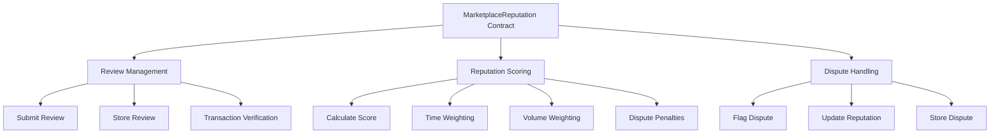

# MarketplaceReputation Contract Documentation

## Overview
The MarketplaceReputation contract implements a decentralized review and reputation system for marketplace services. It enables users to submit reviews, handles dispute flagging, and maintains a dynamic reputation scoring system.

## Contract Architecture



## Public Functions

### `submit_review`

**Description:**  
Submits a new review for a service in the marketplace.

**Parameters:**
- `deps`: Contract dependencies
- `env`: Environment information
- `info`: Message information (includes sender)
- `service`: String identifier of the service being reviewed
- `rating`: u8 value between 1-5
- `content`: String content of the review
- `transaction_proof`: String proof of transaction
- `signature`: Vec<u8> signature data

**Returns:**  
`StdResult<Response>` with review submission details

**Example Usage:**
```rust
// Frontend integration example
const msg = {
    submit_review: {
        service: "service_id_123",
        rating: 5,
        content: "Excellent service!",
        transaction_proof: "tx_hash_abc",
        signature: [1, 2, 3] // Generated signature bytes
    }
};

const response = await contract.execute(msg);
```

**Gas Usage:**  
Approximate gas cost: 100,000 - 150,000 gas units
- Storage operations: ~50,000
- Computation: ~30,000
- State updates: ~20,000

### `flag_dispute`

**Description:**  
Flags a review as disputed, affecting the reviewer's reputation score.

**Parameters:**
- `deps`: Contract dependencies
- `env`: Environment information
- `info`: Message information (includes sender)
- `review_id`: String identifier of the review
- `reason`: String reason for the dispute

**Returns:**  
`StdResult<Response>` with dispute flagging details

**Example Usage:**
```rust
// Frontend integration example
const msg = {
    flag_dispute: {
        review_id: "1234567890-addr123",
        reason: "Fraudulent review"
    }
};

const response = await contract.execute(msg);
```

**Gas Usage:**  
Approximate gas cost: 80,000 - 120,000 gas units
- Storage operations: ~40,000
- Computation: ~20,000
- State updates: ~20,000

## Reputation Parameters

The contract uses the following parameters for reputation calculation:

```rust
pub struct ReputationParams {
    time_weight_factor: u32,      // Weight for time-based decay
    volume_weight_factor: u32,    // Weight for transaction volume
    dispute_penalty: u32,         // Penalty for disputed reviews
    inactivity_decay_period: u64, // Period for reputation decay (seconds)
    decay_rate: u32,             // Reputation retention rate (%)
}
```

## State Management

The contract maintains several key state items:

1. **REVIEWS**: Stores all review data
   - Key: review_id (String)
   - Value: Review struct

2. **USER_REVIEWS**: Maps users to their reviews
   - Key: (user_address, review_id)
   - Value: review_id

3. **USERS**: Stores user reputation data
   - Key: user_address
   - Value: UserReputation struct

4. **REPUTATION_PARAMS**: Stores reputation calculation parameters
   - Single entry containing ReputationParams

## Integration Guidelines

### Frontend Integration

1. **Connection Setup:**
```javascript
const client = await CosmWasmClient.connect(rpcEndpoint);
const contract = new Contract(client, contractAddress);
```

2. **Submitting Reviews:**
```javascript
async function submitReview(service, rating, content) {
    const proof = await generateTransactionProof();
    const signature = await signReview(content);
    
    const msg = {
        submit_review: {
            service,
            rating,
            content,
            transaction_proof: proof,
            signature
        }
    };
    
    return await contract.execute(msg);
}
```

3. **Querying Reputation:**
```javascript
async function getUserReputation(address) {
    const query = {
        get_user_reputation: {
            address
        }
    };
    
    return await contract.query(query);
}
```

### Error Handling

Common error scenarios and handling:

1. Invalid Rating:
```javascript
try {
    await submitReview(service, 6, content); // Rating > 5
} catch (error) {
    // Handle "Rating must be between 1 and 5" error
}
```

2. Invalid Transaction Proof:
```javascript
try {
    await submitReview(service, 5, content, invalidProof);
} catch (error) {
    // Handle "Invalid transaction proof" error
}
```

## Gas Optimization Tips

1. **Batch Operations:**
   - Group multiple reviews when possible
   - Use transaction batching for multiple operations

2. **Storage Optimization:**
   - Keep review content concise
   - Consider off-chain storage for lengthy content

3. **Query Efficiency:**
   - Use pagination for large data sets
   - Cache frequently accessed reputation scores